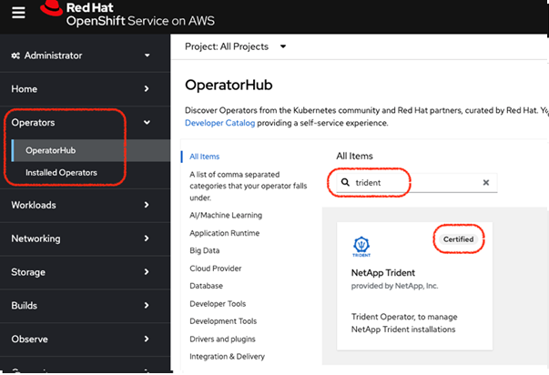

= 使用 OpenShift OperatorHub 安装 Trident
:hardbreaks:
:allow-uri-read: 
:icons: font
:imagesdir: ../media/

[role="lead"]
如果您使用红帽 OpenShift，则可以使用红帽认证操作员安装 NetApp Trident。使用此过程从 Red Hat OpenShift Container Platform 安装 Trident。

.开始之前
在您开始安装之前，link:../trident-get-started/requirements.html["为 Trident 安装准备环境"]。

== 查找并安装 Trident 操作员

.步骤
. 导航到 OpenShift OperatorHub 并搜索 NetApp Trident。
+

. 单击 *NetApp Trident* 打开安装设置。
. 选择所需的选项，然后单击 *Install* 以打开 Operator 配置。
+
image::../media/openshift-operator-02.png[安装]

+

NOTE: 确保选择最新的 Operator 版本。

. 保留所有参数，然后单击 *Install*。
+
image::../media/openshift-operator-03.png[安装]

+
安装完成后，Operator 将在已安装 operator 列表中显示，并且随时可以使用。

. 单击 *View Operator* 以查看 Operator 的详细信息。
+
image::../media/openshift-operator-04.png[已安装]

. 在 *Trident Orchestrator* 下，单击 *Create instance*。
+
image::../media/openshift-operator-07.png[已安装]

. 单击 *YAML view* 并将以下内容粘贴到表单中：
+
[source, yaml]
----
apiVersion: trident.netapp.io/v1
kind: TridentOrchestrator
metadata:
  name: trident
  namespace: openshift-operators
spec:
  IPv6: false
  debug: false
  nodePrep:
  - iscsi
  imageRegistry: ''
  k8sTimeout: 30
  namespace: trident
  silenceAutosupport: false
----
+
[]
====
** Red Hat Enterprise Linux CoreOS (RHCOS) 未启用和配置 iSCSI。
** 您可以添加  `nodePrep` 参数以在所有 OpenShift 工作节点上配置和启用 iSCSI 和多路径服务。
** 从 OpenShift 4.19 开始，此功能支持的最低 Trident 版本为 25.06.1。

====
. 单击 *Create*；Trident Orchestrator 将完全安装。
+
image::../media/openshift-operator-08.png[已安装]

== 卸载 Trident 操作员

.步骤
. 从已安装操作员列表中选择 Trident 操作员。
. 如果要从运算符中删除所有操作数实例，请选择此项。
+

WARNING: 如果未选中*从此运算符中删除所有操作数实例*复选框，则不会卸载 Trident。

. 单击 *Uninstall* 。

